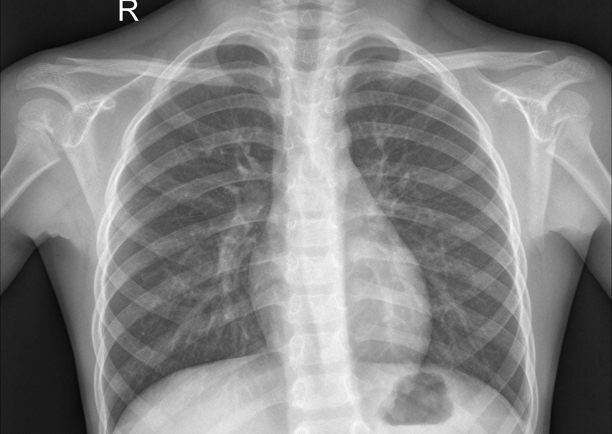
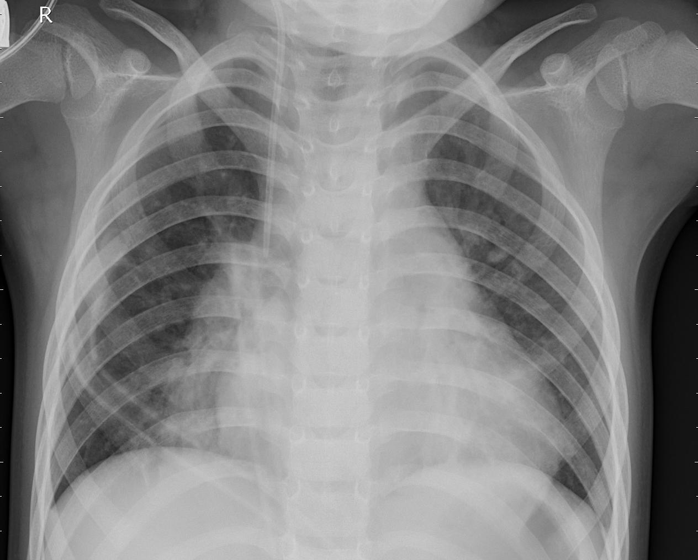
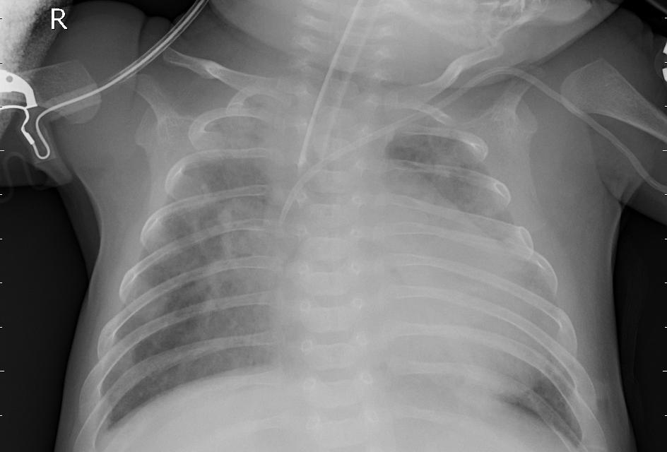
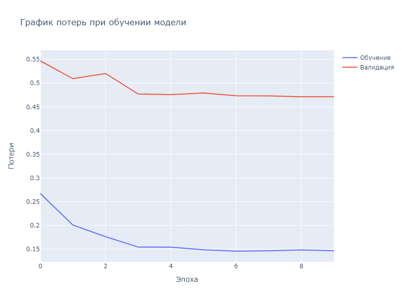
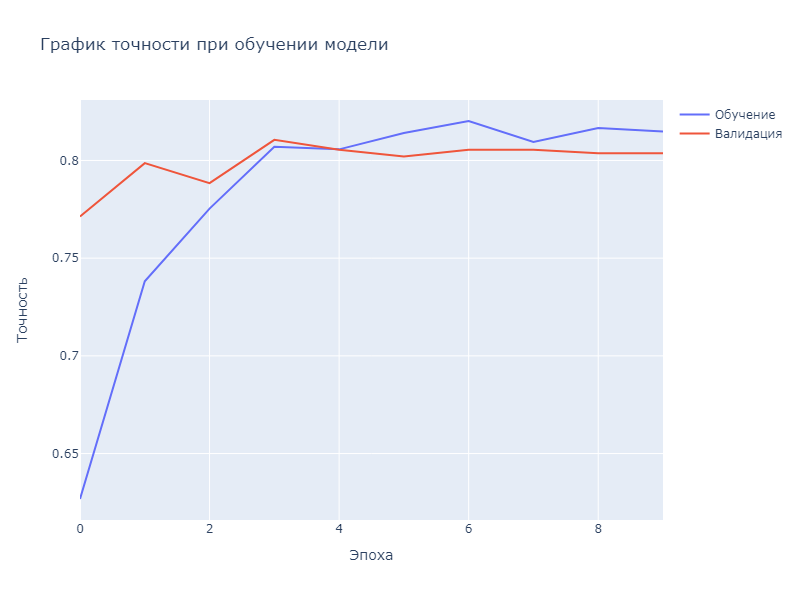
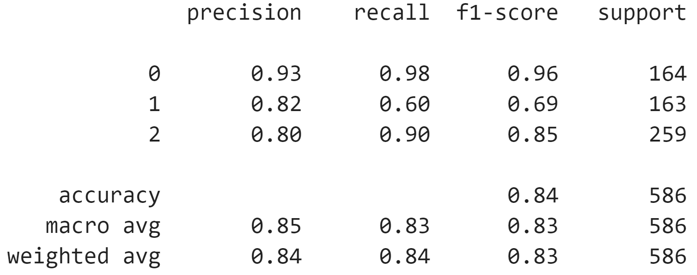

# X-PneumoNet

Chest X-ray pneumonia classification using pretrained CNN and Vision Transformer architectures with transfer learning.

## Dataset

[Chest X-Ray Images (Pneumonia)](https://www.kaggle.com/datasets/paultimothymooney/chest-xray-pneumonia) — a labeled collection of lung X-ray images for three classes: normal, bacterial pneumonia, and viral pneumonia.

**Normal**



**Bacteria**



**Virus**



## Project Structure

```
├── .gitignore
├── LICENSE
├── README.md
├── requirements.txt
├── notebooks/
│   └── training.ipynb
├── src/
│   ├── __init__.py
│   ├── dataset.py          # Dataset loader with augmentation
│   ├── models.py            # Model factory (26 pretrained architectures)
│   ├── config.py            # Model names, layer mappings, weight configs
│   ├── preprocessing.py     # Augmentation pipeline
│   └── labels.py            # Label dictionaries
└── assets/
    ├── accuracy.png
    ├── loss.png
    ├── metrics.png
    ├── normal.jpeg
    ├── bacteria.jpeg
    └── virus.jpeg
```

## Architecture

The model factory supports 26 pretrained architectures (CNN, ViT, BlockCNN, Hybrid CNN + ViT) via a unified interface:

```python
from src import get_image_model

model, preprocess = get_image_model(
    name="convnext",
    pretrained=True,
    freeze_weight=False,
    num_classes=3
)
```

## Training

The training notebook is located at [`notebooks/training.ipynb`](notebooks/training.ipynb). Configuration example:

```python
device = "cuda" if torch.cuda.is_available() else "cpu"
dataset_path = "path/to/chest_xray"
image_model_type = "convnext"
num_classes = len(inference_dict)
pretrained = True
freeze_weight = False
num_epochs = 10
batch_size = 3
```

## Results (ConvNeXt, 10 epochs)







ConvNeXt achieved 96% accuracy on healthy lungs and 77% accuracy in distinguishing bacterial vs. viral pneumonia after 10 epochs.

## Model Weights

| Model        | Weights |
|--------------|---------|
| MobileNet V3 | [download](https://drive.google.com/file/d/1DqWQrytyKZs17D3K6Bf2JD_77CBMEQ6L/view?usp=sharing) |
| ConvNeXt L   | [download](https://drive.google.com/file/d/1aYgPcH0xoivfDVu1Ofq9LcbIBj3q8U-a/view?usp=sharing) |

## Installation

```bash
pip install -r requirements.txt
```

## License

[MIT](LICENSE)
