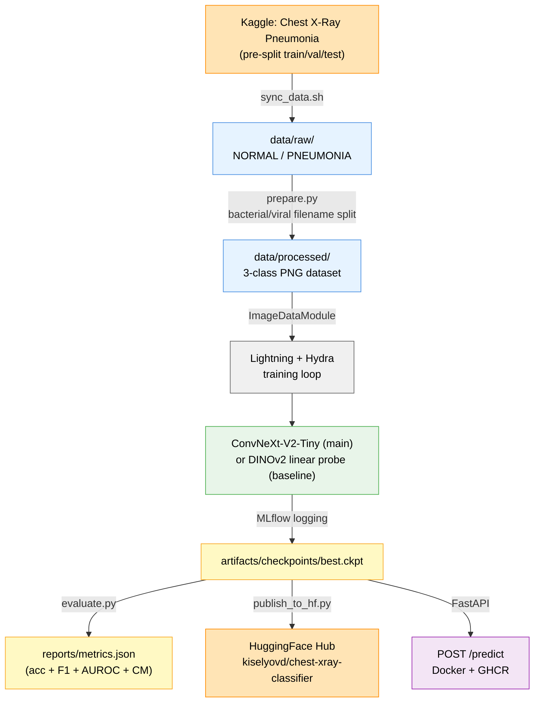

# Architecture

## Data flow

## Model choices

- **Main — ConvNeXt-V2-Tiny.** Modern CNN with strong ImageNet-22k pretraining; good accuracy/compute balance for medical imaging. Pre-trained via `transformers.ConvNextV2ForImageClassification` with a 3-label classification head.
- **Baseline — DINOv2 ViT-S linear probe.** Frozen self-supervised backbone (`facebook/dinov2-small`) with a single trainable linear layer on top of the `[CLS]` embedding. Acts as a methodology sanity check — the main model must clearly beat a frozen generic feature extractor to justify the compute.

## Metrics

| Metric | Why |
|---|---|
| Per-class precision/recall/F1 | Detect class-specific weakness (viral is the hardest + smallest class) |
| Macro F1 | Headline number tolerant of class imbalance |
| Confusion matrix | Expose bacterial↔viral confusions (clinically meaningful) |
| Macro AUROC (OvR) | Threshold-independent separability, averaged over classes |

Accuracy alone is avoided — bacterial_pneumonia dominates the train split.

## Key conventions

- Class index order is alphabetical, matching `torchvision.ImageFolder`: `("bacterial_pneumonia", "normal", "viral_pneumonia")`.
- Checkpoint contains `model_name` in its hyperparameters so `inference.load_model` can rebuild the backbone without metadata supplied by the caller.
- Lightning trainer seed-controlled via Hydra `seed`; deterministic mode on.
