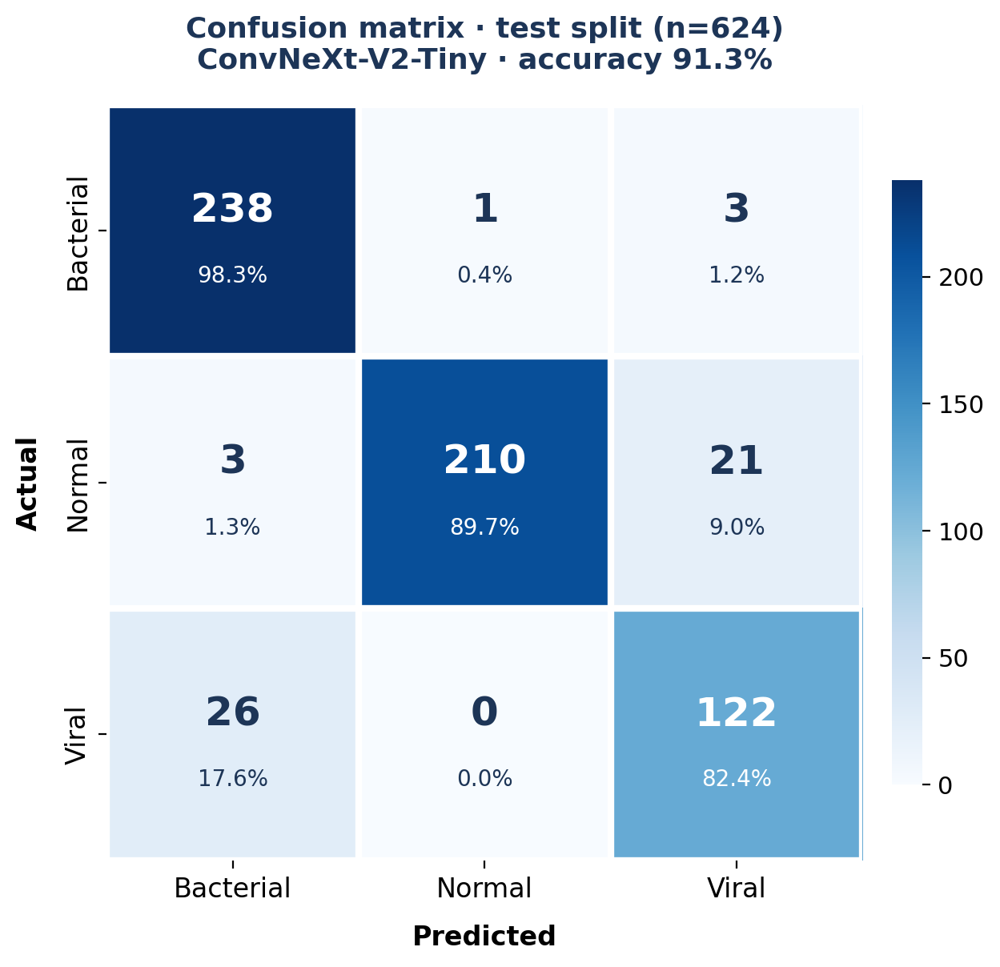

# chest-xray-classifier

Production-grade 3-class chest X-ray classifier distinguishing **normal**, **bacterial pneumonia**, and **viral pneumonia** on pediatric frontal radiographs.

## Overview

| | |
|---|---|
| **Task** | Multiclass image classification (3 classes) |
| **Dataset** | [Kaggle Chest X-Ray Images (Pneumonia)](https://www.kaggle.com/datasets/paultimothymooney/chest-xray-pneumonia) — 5,856 radiographs |
| **Main model** | ConvNeXt-V2-Tiny (`facebook/convnextv2-tiny-22k-224`) fine-tuned |
| **Baseline** | DINOv2 ViT-S linear probe (`facebook/dinov2-small`) |
| **Stack** | PyTorch Lightning · Hydra · MLflow · DVC · FastAPI · Docker · GitHub Actions · MkDocs |
| **License** | MIT |

## Sections

- [Architecture](architecture.md) — data flow, model choices, metrics rationale
- [Training](training.md) — running experiments, logging, overrides
- [Serving](serving.md) — FastAPI endpoints, Docker deployment
- [Benchmarks](BENCHMARKS.md) — vs literature, trade-offs
- [Reproducibility](REPRODUCIBILITY.md) — pinned environment, one-command re-run
- [Limitations](LIMITATIONS.md) — failure modes, dataset bias
- [Model card](model_card.md.j2) — HF Hub card template

## Links

- **Code:** [GitHub](https://github.com/kiselyovd/chest-xray-classifier)
- **Model:** [Hugging Face](https://huggingface.co/kiselyovd/chest-xray-classifier)

## Disclaimer

Research/educational artifact only — **not** intended for clinical use.
